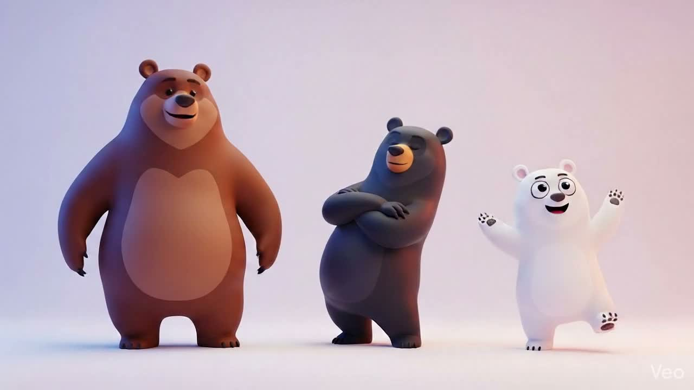
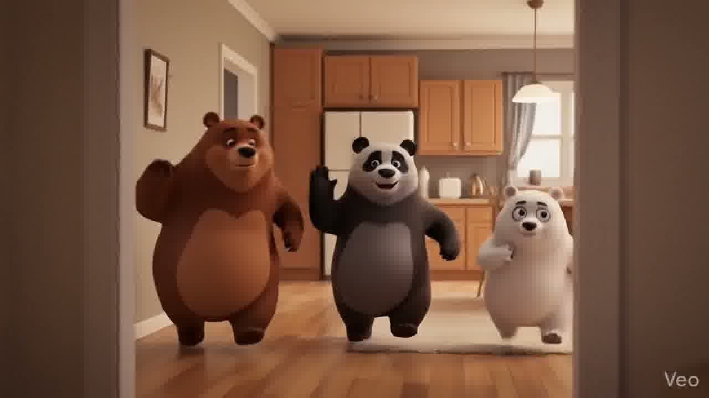

# 🐾 We Bare Bears Fan Hub

> A multi-page, animated fan website for the Cartoon Network series **We Bare Bears** — featuring a flipbook animation, film reel gallery, episode directory, merchandise shop, and a full CRUD Wishlist Manager.

---

## 👥 Team Members

| Name | Roll No. | Responsibility |
|------|----------|---------------|
| **Osman** | 23L-5564 | JavaScript (Logic & Interactivity) |
| **Ramish** | 23L-5505 | CSS (Styling & Animations) |
| **Owais** | 23L-5515 | HTML (Structure & Markup) |
| **Shakir** | 23L-5567 | HTML (Structure & Markup) |

---

## 📁 Project File Structure

```
We Bare Bears/
│
├── index.html          ← Home page
├── series.html         ← Cartoon Series + Episode Directory
├── characters.html     ← Character Profiles
├── shop.html           ← Merch Shop + Wishlist CRUD
├── contact.html        ← Contact Form + FAQ
│
├── style.css           ← Global Stylesheet (all pages)
├── script.js           ← Main JavaScript (all logic)
├── episodes-data.js    ← Episode data array (141 episodes)
│
└── Asset/
    └── Frame/          ← 96 animation frames (ezgif-frame-001.jpg … 096.jpg)
```

---

## 📄 Page Descriptions

---

### 1. `index.html` — Home Page

**Purpose:** The landing page. First thing visitors see. Introduces the site with a hero, hub cards, and an about section.

**Key Sections:**
- **Page Loader** — Full-screen bouncing paw animation while the page loads
- **Navbar** — Fixed navigation with cart button and mobile hamburger menu
- **Hero Section** — Two-column layout: left has the title, CTA buttons and stats strip; right has the live flipbook animation
- **Hub Section** — 4 cards linking to Series, Characters, Shop, and Contact with a tech stack strip below
- **About Section** — Show overview with polaroid-style photo grid and fun fact badges
- **Feature Cards** — 3 cards highlighting what makes We Bare Bears special
- **Cart Drawer** — Slide-in shopping cart (shared across all pages)

**Code Highlight — Hero two-column grid:**
```html
<div class="hero-grid">
  <!-- Left: text -->
  <div class="hero-text-col">
    <span class="hero-badge">✦ Fan-Made Tribute Site</span>
    <h1 class="hero-title">Welcome to We Bare Bears World 🐾</h1>
    <div class="hero-btns">
      <a href="series.html" class="btn btn-primary">🎬 Explore Series</a>
      <a href="shop.html"   class="btn btn-secondary">🛍️ Visit Shop</a>
    </div>
    <div class="hero-stats">
      <div class="hero-stat"><span class="hero-stat-num">4</span><span class="hero-stat-lbl">Seasons</span></div>
      <div class="hero-stat"><span class="hero-stat-num">140+</span><span class="hero-stat-lbl">Episodes</span></div>
    </div>
  </div>
  <!-- Right: flipbook -->
  <div class="hero-flipbook-col">
    <div class="flipbook-wrapper">
      
    </div>
  </div>
</div>
```

---

### 2. `series.html` — Cartoon Series Page

**Purpose:** Dedicated page for exploring the show — YouTube thumbnail, scrollable film reel, and the full episode directory.

**Key Sections:**
- **Page Hero** — Dark gradient background with star glow effects
- **YouTube Card** — Clickable thumbnail that links to We Bare Bears on YouTube (replaces fragile iframe embed)
- **Film Reel** — Horizontally scrollable strip of all 96 frames — click any frame to open it in a lightbox. Loads lazily via `IntersectionObserver`
- **Episode Directory** — Fully dynamic: 141 episodes across 4 seasons + movie, with season tabs, live search, episode count, and YouTube Watch buttons

**Code Highlight — YouTube thumbnail card:**
```html
<a class="yt-card" id="series-youtube-card"
   href="https://www.youtube.com/results?search_query=We+Bare+Bears+Cartoon+Network+official"
   target="_blank" rel="noopener noreferrer">
  <div class="yt-thumb-wrap">
    
    <div class="yt-play-btn">
      <!-- SVG red play button circle -->
    </div>
  </div>
  <p class="yt-card-label">▶ Watch We Bare Bears on Cartoon Network YouTube</p>
</a>
```

**Code Highlight — Episode directory search & filter (JavaScript):**
```js
var filtered = WBB_EPISODES.filter(function(ep) {
  var matchSeason = currentSeason === 'all' || String(ep[0]) === String(currentSeason);
  var matchSearch = !q || ep[2].toLowerCase().includes(q) || ep[3].toLowerCase().includes(q);
  return matchSeason && matchSearch;
});
```

---

### 3. `characters.html` — Characters Page

**Purpose:** Profile cards for Grizzly, Panda, and Ice Bear with personality stat bars that animate when scrolled into view.

**Key Sections:**
- **Page Hero** — Warm gradient with character watermark frames
- **Bear Facts Strip** — Brown banner with 4 stats: Seasons, Episodes, Bear Brothers, Premiered
- **Character Cards** — One card each for Grizzly, Panda, and Ice Bear. Each has a scene background image, emoji, name, role, quote, personality tags, and animated stat bars
- **Stat Bars** — Animated progress bars (Energy, Charm, Skill etc.) using `IntersectionObserver`

**Code Highlight — Animated stat bars:**
```html
<div class="stat-bar-wrap">
  <div class="stat-label"><span>Energy</span><span>95%</span></div>
  <div class="stat-bar">
    <div class="stat-fill energy" data-width="95"></div>
  </div>
</div>
```
```js
// Triggers the animation when the bar scrolls into view
const obs = new IntersectionObserver(entries => {
  entries.forEach(e => {
    if (e.isIntersecting) {
      e.target.style.width = e.target.dataset.width + '%';
      obs.unobserve(e.target);
    }
  });
}, { threshold: 0.3 });
fills.forEach(f => obs.observe(f));
```

---

### 4. `shop.html` — Shop + Wishlist Manager (CRUD)

**Purpose:** A fan merchandise shop with product cards and a complete **CRUD Wishlist Manager** for saving desired items.

**Key Sections:**
- **Shop Hero** — Orange gradient hero
- **Filter Bar** — Filter products by category (Stickers, T-Shirts, Diaries, Accessories)
- **Products Grid** — 10 product cards, each with a frame background, emoji overlay, name, price, and Add to Cart button
- **Wishlist Manager** — Full CRUD system (see CRUD section below)

#### 🔴 CRUD Operations — Wishlist Manager

All data is stored in `localStorage` under the key `wbb_wishlist`.

| Operation | How It Works |
|-----------|-------------|
| **CREATE** | Fill the Add form → click ➕ Add to Wishlist. Validates name. Saves `{ id, name, category, qty, note, created }` |
| **READ** | `renderWishlist()` reads localStorage, applies search + category filters, renders cards with stats bar |
| **UPDATE** | Click ✏️ Edit on any card → modal opens pre-filled → change values → Save updates item by `id` |
| **DELETE** | Click 🗑 Delete → button changes to `"Sure?"` for 2s → click again to confirm. Clear All removes everything |

**Code Highlight — CREATE (add item):**
```js
const item = {
  id: Date.now(),       // Unique ID
  name,
  category,
  qty,
  note,
  created: new Date().toISOString()
};
const items = loadWishlist();
items.push(item);
saveWishlist(items);    // Saves to localStorage
renderWishlist();       // Re-renders the grid
```

**Code Highlight — UPDATE (save edit):**
```js
const id = parseInt(document.getElementById('edit-id').value, 10);
const items = loadWishlist();
const idx = items.findIndex(it => it.id === id);
if (idx !== -1) {
  items[idx] = { ...items[idx], name: editName, category, qty, note };
  saveWishlist(items);
}
closeModal();
renderWishlist();
```

**Code Highlight — DELETE (double confirm):**
```js
btn.addEventListener('click', () => {
  if (btn.dataset.confirm === 'true') {
    saveWishlist(loadWishlist().filter(it => it.id !== id));
    renderWishlist();
  } else {
    btn.dataset.confirm = 'true';
    btn.textContent = 'Sure?';
    deleteTimer = setTimeout(() => {
      btn.textContent = '🗑 Delete';
      delete btn.dataset.confirm;
    }, 2000);
  }
});
```

---

### 5. `contact.html` — Contact Page

**Purpose:** A contact form with validation and an FAQ accordion section.

**Key Sections:**
- **Contact Hero** — Light blue/yellow gradient
- **Info Cards** — Bear HQ address, email, support hours, and social links
- **Contact Form** — Fields: Name, Email, Subject (dropdown), Message. All required fields validated with inline errors and `aria-invalid` for accessibility
- **Success State** — Form hides and a success message appears on valid submit
- **FAQ Accordion** — 5 collapsible questions with smooth `max-height` animation

**Code Highlight — Form validation with ARIA:**
```html
<input type="text" id="name"
       aria-describedby="name-error"
       aria-invalid="false"
       required />
<span class="form-error" id="name-error" role="alert">
  Please enter your name.
</span>
```
```js
// On submit, sets aria-invalid based on validation result
field.setAttribute('aria-invalid', field.value.trim() ? 'false' : 'true');
```

---

## 🎨 `style.css` — Global Stylesheet

**Written by: Ramish (23L-5505)**

**Purpose:** All visual styling for the entire site — one file used across all 5 pages.

**Key Design System:**
```css
:root {
  --bg:     #FFF8F0;   /* Warm cream background */
  --primary: #A8D8EA;  /* Sky blue (Ice Bear) */
  --accent:  #FF8C69;  /* Coral orange (Grizz) */
  --brown:   #8B5E3C;  /* Bear brown (borders/text) */
  --yellow:  #FFE59E;  /* Warm yellow (Panda) */
  --dark:    #2C2C2C;  /* Near-black text */
  --radius:  20px;     /* Rounded corners */
  --shadow:  4px 4px 0px var(--brown); /* Retro hard shadow */
}
```

**Notable CSS Features:**

| Feature | Description |
|---------|-------------|
| Custom cursor | SVG bear paw cursor via `cursor: url(...)` |
| Floating bubbles | `@keyframes floatUp` animation for background bubbles |
| Mobile nav drawer | `transform: translateY(-120%)` slides in via `.open` class — no `display:none` bug |
| Page loader | `opacity` + `visibility` fade-out on `.hidden` class |
| Scroll reveal | `.reveal` → `.visible` via `IntersectionObserver` in JS |
| Glassmorphism navbar | `backdrop-filter: blur(14px)` when scrolled |
| Film reel | Custom scrollbar, sprocket holes, hover zoom effect |
| Wishlist cards | Grid auto-fill, hover lift, modal overlay |
| Focus styles | `:focus-visible` 3px accent outline for keyboard users |

---

## ⚙️ `script.js` — Main JavaScript

**Written by: Osman (23L-5564)**

**Purpose:** All interactive behaviour across every page. Wrapped in an IIFE to keep variables out of global scope.

**Structure:**
```js
(function () {
  'use strict';

  // 1. Page Loader
  // 2. Navbar (scroll + active links + hamburger + aria-expanded)
  // 3. Flipbook Animation (96 frames @ 80ms + 5-frame preloader)
  // 4. Lightbox (open/close/keyboard)
  // 5. Cart (localStorage, qty controls, checkout modal)
  // 6. Product Filter (category buttons)
  // 7. Scroll Reveal (IntersectionObserver)
  // 8. Contact Form (validation + aria-invalid)
  // 9. Film Reel (IntersectionObserver lazy load + keyboard support)
  // 10. Polaroid Grid (random frame picks)
  // 11. Watermark Frames (dynamic frame distribution)
  // 12. Episode Cards (frame thumbnails)
  // 13. Character Backgrounds
  // 14. Product Frame Images
  // 15. Wishlist CRUD (Create / Read / Update / Delete)

  document.addEventListener('DOMContentLoaded', () => {
    initBubbles();
    initNavbar();
    initFlipbook();
    initFilmReel();
    // ... all other inits
    initWishlist();
  });
})();
```

**Key Functions:**

| Function | Purpose |
|----------|---------|
| `initFlipbook()` | Cycles 96 frames at 80ms with 5-frame ahead preloading |
| `initFilmReel()` | Lazy-loads all 96 frame images only when section is visible |
| `addToCart(name, price, img)` | Adds/increments item in localStorage cart |
| `renderCartItems()` | Renders cart drawer with delegated qty controls |
| `updateCartBadge()` | Updates all `.cart-badge` elements with current total |
| `renderWishlist()` | Reads, filters, and renders wishlist cards from localStorage |
| `initWishlist()` | Sets up all CRUD event listeners for the wishlist |

---

## 📊 `episodes-data.js` — Episode Data

**Purpose:** A standalone data file containing all 141 episodes (Season 1–4 + Movie) as a JavaScript array. Loaded before `script.js` on the series page only.

**Format:**
```js
var WBB_EPISODES = [
  // [season, epNumInSeason, title, shortDescription, youTubeId|null]
  [1, 1, 'Our Stuff',    'The bears chase their stolen backpack across the city.', null],
  [1, 2, 'Viral Video',  'Grizz films a video to make the bears internet famous.', 'oZC4iG1aC7w'],
  // ... 139 more entries
  ['m', 1, 'We Bare Bears: The Movie', 'The bears face their greatest threat.', null]
];
```

- Season values: `1`, `2`, `3`, `4`, `'m'` (movie)
- 25 confirmed YouTube video IDs for Season 1 episodes
- Used only by `series.html` — does not load on other pages

---

## 🚀 How to Run

1. Open the `We Bare Bears` folder
2. Double-click `index.html` — or open it in any modern browser
3. No build tools, no npm, no server required
4. All assets are local — works completely offline

> **Browser support:** Chrome, Firefox, Edge, Safari (any modern version)

---

## 🛠️ Technologies Used

| Technology | Purpose |
|-----------|---------|
| **HTML5** | Page structure and semantic markup |
| **CSS3** | Styling, animations, grid, flexbox |
| **Vanilla JavaScript** | All interactivity and DOM manipulation |
| **localStorage** | Cart and Wishlist data persistence |
| **IntersectionObserver API** | Scroll reveal and lazy loading |
| **CSS Custom Properties** | Design token system (colours, shadows) |
| **Web Animations / Keyframes** | Flipbook, loader, bubbles, stat bars |

---

## 📋 Features Summary

- ✅ 5-page responsive website
- ✅ Animated flipbook (96 frames, 80ms per frame)
- ✅ Lazy-loaded film reel with lightbox
- ✅ Full episode directory — 141 episodes, searchable & filterable
- ✅ Shopping cart with localStorage persistence
- ✅ **Full CRUD Wishlist Manager** (Create, Read, Update, Delete)
- ✅ Page loading screen with progress bar
- ✅ Mobile responsive with hamburger nav drawer
- ✅ Open Graph + Twitter Card meta tags
- ✅ Keyboard accessible (focus styles, ARIA, Enter/Space support)
- ✅ Custom bear paw cursor

---

*We Bare Bears is © Cartoon Network / Warner Bros. Discovery. This is a fan-made tribute site created for educational purposes.*
